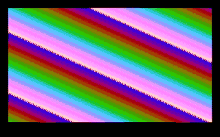

# The crazy network: specialised hardware, general software, found by search

A test of the design principle in `techniques.md`: build hardware that does
not look general purpose, then use offline search and judgement to find what
it can do. Instead of designing an effect and building hardware for it, the
hardware came first, a ring of simple cells with randomly drawn sparse
links, and the effects were discovered.

## The hardware (`model.ml`, `crazy_rtl.ml`)

A ring of 64 cells, each holding 8 bits, stepping in lockstep. The wiring
was drawn once from a fixed seed, the stand-in for tapeout: every cell reads
its left neighbour; 40 % also read a medium-range partner (3 to 12 cells
away), 8 % a partner anywhere, the rest only themselves. The draw gave 37
partner links. A program, loaded through a byte chain, gives each cell an
operation (add, XOR, subtract or max) and a constant, and chooses the
output tap, how often the network steps (every 1, 2, 5 or 10 clocks), whether
the state resets each line, and a 16-colour palette. The CPU streams four
seed bytes per line, XORed into four cells at the start of the line. The
top four bits of the tap cell pick each pixel's colour; timing and colour
output are the PAL retro console's.

## How it was explored

Five approaches, deliberately different, because each finds different
things:

1. **Random sampling with a filter** (2,000 programs, `sheet.py`): 1,598
   were noise, 115 flat, 84 in between. Most programs are chaotic: 64 cells
   of add and XOR mix within a few steps. The chance finds included diagonal
   wave bands, interference chevrons, soft plasma-like bands, a rainbow
   barcode and light streaks.
2. **Evolution toward one objective** (`evolve.ml`): variety times
   structure times smooth motion. The first run reported a score of 83.7
   when every factor is at most 1: OCaml's unary minus binds tighter than
   `**`, so the structure penalty had become a reward and the optimiser
   bred pure noise. After the fix, and a range assertion so it cannot
   happen silently again, the objective was gamed differently: every top
   entry was the same horizontal stripes over a vertical comb, structured,
   varied, smooth and boring.
3. **Quality-diversity search, MAP-Elites** (`mapelites.ml`): keep the
   best program in each cell of a grid over orientation, motion and
   coarseness. It filled 56 of 100 cells, a map of the network's repertoire
   rather than one champion.
4. **Judged evolution**: from the map, eight favourites were chosen by eye,
   mutated eight times each, and judged again (`out/judge_sheet.png`).
   Children showed things neither parent had: woven zigzag chevrons,
   ribbons with ripples, flowing organic weaves.
5. **Judging motion** (`out/motion_sheet.png`): stills cannot show
   animation, so the picks were run for 150 fields and viewed as time
   strips. Two programs that change every pixel in every field turned out
   to be colour cycling, the pattern standing still while the rainbow flows
   through it, an effect nobody asked for. Another drifts as a rainbow
   gradient for a few seconds and then melts into a weave.

The reel, chosen by judgement: calm diagonal colour cycling (141.0), woven
chevrons cycling (040.0), breathing ribbons (241.1), and the melting
rainbow (312.0).

## What the TV showed

The reel is the network's own pin output, simulated in Hardcaml and decoded
by the software TV (`out/reel_stills.png`: each scene early and late). The
calm diagonal colour cycling and the breathing ribbons survive composite
video intact. The other two do not look like their previews: the woven
chevrons lose their weave, and the melting rainbow's late weave becomes
colour noise. Composite video carries colour at about 1.3 MHz, one colour
change every four or five pixels, so the fine patterns that looked best in
the false-colour previews are exactly what the format cannot show. Judging
should have looked through the real pipeline, not a preview of it; that is
the next change to the search.

## Checks and numbers

| Check | Result |
| --- | --- |
| RTL against the model, three programs, two fields each | 368,640 pixel samples, 0 mismatches |
| Same with a planted bug (subtraction reversed) | about 57,700 mismatches per program, caught |
| Synthesis on sg13g2, flattened | 14,412 cells, 218,616 um2, 1,757 flip-flops |

The area is about seven Tiny Tapeout tiles at full utilisation; 1,176 of the
flip-flops hold the program, which is loaded once and could live in latches
or the SRAM macro instead. Not through place and route.

## Lessons

- An objective alone finds one thing and polishes it, and it will satisfy
  the letter of the score with something dull. Diversity search maps the
  space; judgement picks from the map. Both were needed.
- The optimiser found the scoring bug before it found anything worth
  seeing. A score that can leave its intended range should assert.
- Judge through the real output path. Fine patterns chosen from
  false-colour previews turned into colour noise on composite video.
- The best finds were not the ones any search was aiming for: colour
  cycling and a slow melt were visible only when looking at motion, which
  none of the scores measured.

## Not done

Choosing palettes per scene (all four use the default rainbow), the
analytic approach (XOR-only programs make the network linear, so its
patterns can be designed rather than found), links with delays, a judging
page so a human can pick from any device, and place and route.

Build and run (Hardcaml v0.17, Python via uv):

    opam exec --switch=5.3.0 -- dune build
    ./_build/default/main.exe search 0 125          # random programs (run slices in parallel)
    uv run sheet.py                                # score and contact sheets
    ./_build/default/main.exe mapelites 60 64 -    # quality-diversity map
    ./_build/default/main.exe rtlcheck out/judge.txt 141.0,312.0,241.1 2
    ./_build/default/main.exe rtldump out/judge.txt 141.0 100 reel_141.0
    uv run ../retro-console/console_tv.py frames reel_141.0

## Coverage-guided fuzzing (2026-09-23)

`fuzz.ml` is the first fuzzer: hand-instrumented against the model, and the precursor of `../hwfuzz`. Coverage families:

- per cell, 4-grams of its data-dependent decisions (which operand won a `max`, whether an add, subtract or XOR wrapped);
- recurring pixel motifs;
- how much of the picture moves between fields.

The engine borrows from AFL (favoured entries, havoc, splicing) and from Hypothesis (swarm testing, shrinking). The comparison is against random programs put through the same coverage filter. Queues were judged with `sheet.py`'s filter (`queue_eval.py`, `queue_breakdown.py`); each run is 20,000 executions.

**Version 1: motifs on raw pixels.**

| | Coverage | Queue | In between | Too simple | Noise |
|---|---|---|---|---|---|
| Random, seed 11 | 4,433 | 720 | 191 | 411 | 53 |
| Random, seed 12 | 4,266 | 734 | 165 | 430 | 67 |
| Fuzzing, seed 11 | 5,835 | 946 | 71 | 802 | 14 |
| Fuzzing, seed 12 | 6,083 | 1,141 | 308 | 699 | 20 |

Most of the fuzzers' "too simple" entries were fine periodic textures that a TV turns into colour mush (`out/fuzz_v1/`).

**Version 2: motifs on 4-pixel symbols**, what composite colour can resolve.

| | Coverage | Queue | In between | Too simple |
|---|---|---|---|---|
| Random, seed 21 | 1,773 | 195 | 40 | 96 |
| Random, seed 22 | 1,751 | 175 | 41 | 90 |
| Fuzzing, seed 21 | 3,607 | 994 | 255 | 626 |
| Fuzzing, seed 22 | 3,932 | 999 | 19 | 931 |

**Reading.** Fuzzing reliably reaches about twice the coverage and keeps far less noise. But its useful output varies wildly with the seed. Seed 22 spent 93 % of its queue on too-simple pictures, which suggests the search latches onto one family of cheap novelty. That is not yet a reliable win.

The decision coverage also counts cells whose decisions never reach the picture. That is the next suspect.
