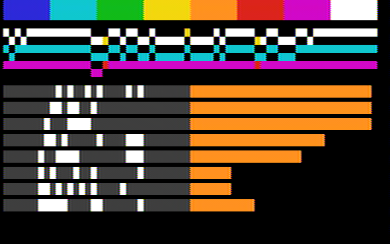

# Several protocols at once, and bridges between them

The deadline sequencer runs four hardware threads round-robin, one instruction per slot, with
nothing shared except the pins. This prototype asks two questions. How many protocols fit on one
sequencer at the same time? And how do threads pass data to each other, so that the chip can
bridge protocols without the host? The answers are:

- a capacity model;
- a small mailbox between threads, with deadline-bounded send and receive, as a variant of the
  ISA and RTL;
- five demonstrations, each checked cycle by cycle in the interpreter and the RTL against
  independent models of both sides:
  - Ethernet to TV;
  - a CAN bus analyser with TV output;
  - UART ↔ I2C;
  - UART ↔ SPI;
  - I2C ↔ CAN.

The base ISA and RTL (`../deadline-sequencer/isa.ml`, `sequencer.ml`) are not modified. They are
symlinked here, as are the 10BASE-T receiver and model from `../ethernet-10base-t`. Every ISA
change lives in `isa_mb.ml` and `sequencer_mb.ml`.

Run with `opam exec --switch=5.3.0 -- dune build`, then:

| executable | what it checks | output |
|---|---|---|
| `lockstep.exe` | the variant's RTL against its interpreter; that it is a strict extension of the base; a planted bug | `results/lockstep.txt` |
| `ethtv.exe all` | Ethernet to TV, isolation, controls | `results/ethtv.txt` |
| `judge_tv.py` | the waveforms through the software TV (`uv run judge_tv.py WAVE EXPECT PNG`) | `results/ethtv_judge.txt` |
| `cantv.exe` | the CAN analyser | `results/cantv.txt` |
| `judge_screen.py` | the CAN analyser pixel by pixel | `results/cantv_judge.txt` |
| `bridges.exe all` | UART ↔ I2C and UART ↔ SPI, the full campaign | `results/bridges.txt` |
| `can_bridge.exe` | I2C ↔ CAN | `results/can_bridge.txt` |
| `loopback.exe` | option (b) against option (c) | `results/loopback.txt` |
| `synth.sh` | area, with Yosys 0.62 in the LibreLane container | `results/synth-summary.txt` |

The waveforms go to `/var/tmp/multi-proto/`.

## 1. Capacity: what fits on one sequencer

A thread owns exactly a quarter of the slots whether it uses them or not. At 60 MHz that is 15
million slots a second per thread. So the budget is **threads (4) and pins**, not a fraction of
slots. A protocol either fits in a thread at its rate or it does not. Then the question is
whether the thread keeps its deadlines, which the budget analysis in §4 checks to the slot.

Merging several slow protocols into one thread would make fractions matter. The compiler could do
that by interleaving their schedules (PLAN.md, "thread interleaving as disjunctions"), but it is
not done here.

**Sources:** "measured" means a programme in this directory or in `../deadline-sequencer` run
against an independent model; "branch" means another agent's branch that is not on master yet;
"estimate" means an instruction count by hand.

| protocol | threads | pins | slots per bit, fastest loop | fastest at 60 MHz, one thread | busy slots per bit at a typical rate | source |
|---|---|---|---|---|---|---|
| UART transmit | 1 | 1 | 4 (SHO LDD WAITD JNZ); bit ≥ 5 slots | 3 Mbaud | 4 of 130 at 115,200 baud (3 %) | measured |
| UART receive | 1 | 1 (+1 RTS) | 4; plus 5 slots of work between the stop-bit sample and the next start (§4) | 1.5 Mbaud (bit ≥ 10 slots) | about 5 of 130; it polls the rest | measured |
| SPI master, full duplex | 1 | 4 | 5 (with the capture option); 8 for the compiler's write-only master | 3 MHz; 1.9 MHz | ≈ 5 of 15 at 1 MHz | measured |
| SPI slave | 1 | 4 | ≈ 6 (two edge polls, SHI, SHO) | ≈ 2 MHz | – | estimate |
| I2C master, with clock stretching | 1 | 2 | 4q + 6, q ≥ 2 | 1 MHz (Fast-mode Plus) | ≈ 12 of 37 at 400 kHz | measured (q = 6) |
| I2C slave | 1 | 2 | ≈ 6 per edge pair; it may stretch the clock | 400 kHz easily | – | estimate |
| PS/2 device or host | 1 | 2 | – | 16.7 kHz clock | under 1 % | branch proto-ps2-can |
| CAN node (RX and TX threads) | 2 | 3–4 | 30 slots per bit at 500 kbit/s | 1 Mbit/s with the CRC and stuffing assists | – | branch proto-ps2-can |
| CAN analyser (receive only) | 1 | 1–3 | as the RX thread | – | – | branch, plus the stand-in here |
| JTAG or SWD master | 1 | 4 or 2 | ≈ 6 (with the capture option) | ≈ 2.5 MHz | – | estimate; branch proto-jtag-swd pending |
| USB low speed | 1–2 | 2 | 10 slots per bit at 1.5 Mbit/s; NRZI, stuffing, CRC-5/16 | – | – | estimate; branch proto-usb-ls pending |
| 10BASE-T transmit, firmware only | **4** | 1–2 | 3 clocks per half-bit, spread over all four threads | – | 100 % of all four | measured (`../sequencer-ethernet`) |
| 10BASE-T receive | 0 + ¼ | 2 | hardware receiver (Manchester and CRC-32) + header matcher; the parser needs 3 instructions per byte, one byte every 12 slots | – | 25 % of one thread during a frame | measured here |
| NTSC video, chasing the beam | 1 | 4 luma + 2 chroma | 12 active slots per 967-slot line | – | 1.2 % (the pin stage does the per-clock work) | measured here |

Only 10BASE-T transmit in pure firmware needs all four threads. Firmware 10BASE-T receive on
proto-eth10 probably does too, unless the sampler and the systolic array take the bits.

**Combinations measured to fit on one sequencer, with all four threads accounted for:**

| combination | threads | pins | status |
|---|---|---|---|
| UART ↔ I2C bridge (3) + SPI master (1) | 4 | 8 | measured, isolation proven (§5) |
| UART ↔ SPI bridge (3) + I2C master (1) | 4 | 8 | measured, isolation proven |
| 10BASE-T receive (¼ of T0) + NTSC (T1) + SPI master (T2) + UART transmit (T3) | 4 | 4 + 4 on the sequencer; video and Ethernet on the stage and receiver pins | measured |
| CAN analyser: CAN RX (T3) + bit renderer (T0) + frame renderer (T2) + NTSC (T1) | 4 | 1–3 CAN + video | measured with the CAN stand-in; CAN RX pending the ISA merge (§6) |
| I2C ↔ CAN: CAN RX + CAN TX + bridge + I2C master | 4 | 4 + 2 | measured with a stand-in for the CAN node. It fits in four threads only if the translator and the assembler are merged, which works because they run one after the other (§6). As built here they take two threads |
| JTAG + SWD + UART console (3) | 3–4 | 8–9 | estimate |
| 10BASE-T transmit in firmware + anything | 5+ | – | does not fit |

**Where generic assists free threads** (the column the coordinator asked for; ✓ = used or
measured here, others are proposals):

| generic assist | frees or enables | protocols that benefit |
|---|---|---|
| mailbox between threads (this work) ✓ | bridges and analysers without the host; one thread per protocol side, one per translation | every bridge; analysers; Ethernet to TV (parser to memory) |
| pin streamer / pin sampler (FIFOs per pin group) ✓ in `../pin-streamer`, `../pin-sampler` | 10BASE-T transmit goes from 4 threads to 0–1; UART and SPI shifting drops to about one instruction per byte | UART, SPI, 10BASE-T TX, LS USB TX, video playback |
| bit-stuffing unit (programmable run length, equal/ones mode) | CAN and USB stuffing inline in the RX/TX thread instead of a second thread or the host | CAN, USB, HDLC |
| CRC unit (programmable polynomial ≤ 16 bits; CRC-32 in the Ethernet receiver) ✓ | CRC without a host round trip | CAN, USB, SD, 1-Wire, Ethernet |
| line-code unit (Manchester, NRZI) ✓ inside the 10BASE-T receiver | half-bit timing out of the threads | 10BASE-T, USB, DALI, IR remote |
| oversampling front end with resync | edge tracking out of the RX threads: UART above 1.5 Mbaud, CAN resync, USB DPLL | UART RX, CAN, USB, PS/2 |
| open-drain / wired-AND pin mode ✓ (SHO od) | – | I2C, SMBus, 1-Wire, CAN transceiver emulation |
| systolic matcher ✓ in `../systolic-matcher` | pattern and filter matching per byte, without thread branches | Ethernet header and SFD, USB SYNC/PID, CAN ID filters, I2C slave address |
| NCO chroma pins + memory streamer + lookup table ✓ (`video.ml`) | composite colour video with 1 thread | NTSC/PAL; with other lookup tables, 4b5b/8b10b-style line codes |
| saturating counters (one generic PE each) ✓ | statistics and rates for analysers | CAN analyser bars; packet counters |

On this evidence the few units that buy the most concurrency are:

1. **The mailbox.** Every bridge and analyser needs it, and it is the only one that changes the
   ISA.
2. **The streamer/sampler.** It turns the one protocol that takes all four threads into one that
   takes none.
3. **Stuffing and CRC.** Without them a CAN or USB node needs the host or an extra thread.

The oversampling front end matters for rates above about 1.5 Mbit/s per thread.

## 2. How threads talk: three options

**(a) Through the host.** Every byte costs an OUT on one thread, a host read, a host write and
an IN on the other. Latency is the host's round trip: microseconds over SPI or USB from the
RP2040, and not deterministic. The host link's bandwidth is shared by every bridge. The chip also
stops being standalone, which rules out the CAN analyser. Not built: it is the status quo.

**(b) Spare pins looped back, with no ISA change** (`loopback.exe`, base ISA and RTL unmodified).
Three pins: *valid*, *ready* and *data*. Because the barrel fixes the phase between two threads,
one rendezvous suffices. The sender's SHO in slot k is seen by the receiver's SHI in slot k,
eight bits in a row.

- **Measured:** 256 random bytes in order. **56 cycles per byte** (1.07 MB/s at 60 MHz), 15 + 13
  words. The RTL matches the interpreter on every cycle.
- **Costs:** both threads are fully occupied for the whole transfer, nothing is buffered, and the
  sender waits until the receiver is at its poll.
- **Control:** with the sender one slot early, 0 of 256 bytes arrive correctly. The link exists
  only because the timing is exact. That is a fun property, but the link costs three pins and two
  threads' attention.

**(c) A mailbox, the choice made here** (`isa_mb.ml`, `sequencer_mb.ml`). Measured on the same
test: **12 cycles per byte** (5 MB/s), 3 + 3 words, no pins. Each side spends 2 of every 3 of its
slots, and the inbox buffers.

### The ISA proposal

It is a strict extension of the base ISA. Opcodes 0xE and 0xF were NOP; SHO bits 6..3 were
unused.

- **Parameters.**
  - `pc_bits`: 6 is the base; 7 gives 128 words per thread.
  - `depth`: 1, 2 or 4 bytes per inbox.
  - Every address field is the low `pc_bits` of the word.
- **State.** One inbox per thread, a FIFO of `depth` bytes. At most one instruction executes per
  cycle, so there is at most one inbox operation per cycle in the whole core. The barrel schedule
  is the arbiter, and no second port is needed.

```
E  MBX    dir[11] ch[10:8] 0[7] fail[pc_bits-1:0]
          ch 0..3: inbox ch;  ch 4..7: generic port ch-4 (outside the core)
          SEND (dir 0): target can accept -> push acc, proceed; else dl = 0 -> jump fail; else stay
          RECV (dir 1): source has a byte -> acc <- pop, proceed; else dl = 0 -> jump fail; else stay
F  WAITC  val[11] cond[10:7] fail[pc_bits-1:0]
          cond 0..7: acc bit; 8..11: inbox cond-8 full; 12..15: flag input cond-12
          condition = val -> proceed; else dl = 0 -> jump fail; else stay
7  SHO    pin[11:9] msb[8] od[7] cap[6] cpin[5:3]   (capture option, for full duplex)
          with cap set, pin cpin is sampled in the same slot and enters the vacated bit
```

**Semantics that keep timing exact.**

- A blocked SEND, RECV or WAITC stays in its own slot exactly as WAITP does. The round-robin never
  changes, so a full or empty mailbox cannot move another thread's edges.
- Every wait is bounded by the thread's own deadline and then jumps to `fail`. An unbounded wait
  has to be written explicitly as `fail` = its own address. The bridges use that only where
  waiting for ever is the right behaviour: an idle thread waiting for work.
- Deadlock between threads is therefore a property of the programme, visible in its text, never of
  the schedule. With `dl = 0`, `WAITC` on an acc bit is a conditional branch in one slot. This was
  the missing piece for parsing bytes: the base ISA could only branch on pins, the counter and
  deadlines.
- Ports make generic blocks first-class: the Ethernet receiver, memory write ports, the video pin
  stage and the CAN frame interface. In-port handshakes match IN and out-port handshakes match
  OUT.

**Verification of the variant** (`results/lockstep.txt`):

- **Lockstep of the RTL against the interpreter:** 300 random programmes × 2,000 cycles for each
  of four configurations, 0 mismatching cycles. Half the programmes are mailbox-heavy. Coverage
  per configuration: 1,286–1,987 inbox pushes, 980–1,257 pops, 138,555–375,689 cycles with a
  full inbox, and 1,997–3,062 port transfers in each direction.
- **Strict extension:** with `pc_bits = 6`, the variant's RTL matches the base interpreter on
  programmes without the new fields. 0 mismatches.
- **Planted bug:** an inbox that never reports full is caught in 14 of 50 programmes (22,534
  cycles). Only programmes that fill an inbox can show it.

**Area** (Yosys 0.62, sg13g2 typical, flattened, instruction memory external; the base
re-synthesised with the same Yosys):

| configuration | µm² | flops | vs base |
|---|---|---|---|
| base sequencer | 17,263 | 179 | – |
| mailbox, depth 1, 64 words | 22,568 | 227 | +31 % |
| mailbox, depth 2, 64 words | 26,362 | 267 | +53 % |
| mailbox, depth 4, 64 words | 32,058 | 339 | +86 % |
| mailbox, depth 2, 128 words | 26,996 | 271 | +56 % |

The inboxes are cheap in logic and dear in flops at 49 µm² each. Depth 2 is 64 data flops, 12
pointer flops and 12 port-register flops, and the rest is the port and condition multiplexers.
Two cheaper stores are worth measuring:

- **latches:** about 31 µm² a bit, per the PLAN's latch table;
- **a shared pool:** one small FIFO or latch array addressed by inbox. That is enough because
  only one operation happens per cycle.

The demos show depth 1 is enough when there is flow control: the UART ↔ I2C backpressure run
passes at depth 1. Depth 4 was needed only where a thread holds three bytes while waiting for a
CAN frame's status.

## 3. The demonstrations

### Ethernet to TV (`ethtv.ml`, `video.ml`, `video_fw.ml`; the flagship)

Raw 10BASE-T frames (EtherType 0x88B5), each carrying one source scanline, are received while
NTSC colour video is generated by chasing the beam. Both run from one 60.852 MHz clock (17 × fsc),
concurrently.

**Capacity split:**

- **Receive:** the 10BASE-T receiver RTL, then a header matcher (broadcast, 0x88B5), then two
  in-ports.
- **T0 (parser):** takes the line number, writes 32 pixel bytes into a line buffer of four
  gain-cell rows, drains the padding, and commits the row only if the CRC was good. It uses 21
  words and about 25 % of its slots during a frame.
- **T1 (video timing):** sync and blanking by SETP on four luma pins, and burst and playback by
  commands to the pin stage, every edge on an exact slot. 84 words. Every line is 967 slots, which
  is 3,868 clocks, 227.5 subcarrier cycles plus 1/17.
- **The stage, all generic:**
  - the NCO's two chroma pins: pin A is high 9 phases of 17 and pin B 8, so their sum is flat;
    the mean phase is the hue and the phase difference the saturation;
  - a memory streamer (64 pixels × 48 clocks);
  - a 16-entry lookup table, chosen by the host from a prediction of what a TV decodes.
- **T2, T3:** an SPI master and a UART transmitter, unrelated to the video, to show isolation.

**Why one scanline per frame means line doubling:** a minimum Ethernet frame with preamble and
gap takes 67.2 µs, longer than an NTSC line (63.6 µs). One frame per line cannot keep up. Each
source line is shown on two TV lines, 120 source lines per field.

**The line buffer's lifetime contract.** A row is written when its frame arrives and read on two
TV lines. The first read writes each byte back, which is how gain cells are refreshed: a read
followed by a write. The longest write-to-read interval measured is **102.9 µs**, under the
120 µs of thin-oxide rows at tt/27 °C. Three runs show the contract matters:

- **Thin-oxide rows at 85 °C (8 µs):** every read violates it. The cells' one-sided decay turns
  the picture black: 172 of 1,920 blocks correct.
- **No refresh on the first read:** the second reads reach 166.5 µs, with 3,578 violations and
  1,088 of 1,920 blocks correct.
- **A reordered pair of frames** (line 91 arrives before line 90): line 91 lives 264 µs. That
  breaks thin-oxide rows (source line 91 decays, 1,904 of 1,920 correct) and is fine in
  thick-oxide rows (≥ 3 ms: 1,920 of 1,920). Reordering by one frame costs one frame time of
  lifetime. The row type should be chosen by the reorder window, not only by the line time.

**Results** (the unmodified `../composite-video/tv.py` finds syncs, locks to each line's burst and
decodes the field; the judge samples each 8-pixel block's centre):

- **Main run:** RTL and interpreter agree on every one of 1,015,416 cycles, and the software TV
  decodes **1,920 of 1,920 blocks** to the colour that was sent. The corrupted frame and the
  filtered frame (wrong EtherType) come out as black lines, as they must.
- **Line periods:** all 258 are exactly 3,868 clocks. The control with one extra slot in the
  active line decodes fine, because a TV tolerates it, but its periods read 3,872. The timing
  contract is checked on the waveform, not only on the picture.
- **Isolation:**
  - the composite is identical cycle for cycle with the neighbours, without them, and under 4
    pairs of random neighbour programmes;
  - the neighbours' pins are identical with and without Ethernet and video.
- **Picture:** `out/ethtv_main.png`.

**A bug in the shared receiver, found here.** `../ethernet-10base-t/eth_rx.ml` does not clear its
byte shift register at frame start. On back-to-back frames the previous frame's last bits plus
the new preamble matched 0xD5 one bit early. Frame 113 (after 112, gap ≥ 9.6 µs) was read with
its header shifted by a bit (0x55 as 0xAA) and dropped. This happened deterministically, with 0
to 3 ns of jitter. Clearing the register fixes it. The fix is in a local copy,
`eth_rx_fixed.ml`, which the demo uses; `rx_shared` in `results/ethtv.txt` reproduces the bug.
The shared file is left for its owner (the proto-eth10 branch).

### CAN bus to TV: a standalone analyser (`cantv.ml`, `can_standin.ml`)

- **Header:** flashes red for 30 fields after an error frame.
- **Waveform:** the last 64 bus bits scrolling, as three two-level traces (bus, node A's TXD,
  node B's TXD). Stuff bits are yellow; the bit where a node lost arbitration is red on its trace.
- **ID table:** eight rows. Each shows the last identifier seen in its slot (ID10..ID8), with its
  control bits, and an activity bar. The bars are eight saturating counters: +32 per frame, −4 per
  field.



**Threads:**

- **T0:** writes each bit's code into a ring row. 3 words, 2 instructions per bit.
- **T2:** renders frame events. It uses a branch tree on the ID and keeps two bytes in its own
  inbox while it branches, so the mailbox doubles as scratch memory. 74 words.
- **T1:** the video-timing thread, identical to Ethernet to TV.
- **T3:** the slot for the CAN RX thread. Here it runs an unrelated UART, and a stand-in supplies
  the events.

**Stage:** memory rows plus a per-line descriptor list (row, palette bank, bar), which is a
display list as DMA engines have.

**Results:** 79 transmissions, 12 of them arbitration contests, one error frame.

- **Stage against the reference analyser:** the stage's output matches an independent reference
  analyser, which sees only the event history, on **15,360 of 15,360 pixels**. The counters and
  the flash state are also equal.
- **Through the software TV:** it decodes **15,360 of 15,360 pixels** to the expected palette
  colour, both with the error frame and without it (then no flash).
- **RTL against the interpreter:** 0 mismatches.
- **Isolation:** holds.
- **Lifetime:** display rows are re-read once per field, so the longest interval is **15.95 ms**.
  That fits thick-oxide rows at tt (12–20 ms) only at the upper end, and fails at the worst case
  (≥ 3 ms). A standalone display needs a refresh sweep at least twice per field, or SRAM. This
  is a real cost the Ethernet buffer does not have.

### UART ↔ I2C, UART ↔ SPI (`bridges.ml`, `bridge_lib.ml`)

**Bridge A (UART ↔ I2C)** is four threads:

- **T0, UART receive:** raises RTS when the I2C thread's inbox is full.
- **T1, I2C master:** runs a byte code (START, STOP, WRITE b, READ, ACK, NACK) and honours clock
  stretching on every SCL rise, bounded by its deadline. 99 words.
- **T2, UART transmit.**
- **T3:** an unrelated SPI master.

**Bridge B (UART ↔ SPI):** a full-duplex SPI master built on SHO with capture, with an I2C master
as T3.

**The other side of each bridge:**

- **Host:** a UART model that honours CTS, with random gaps and a baud error.
- **Devices:** a bit-level I2C slave with random clock stretching (up to 1,500 cycles) and
  a bit-level SPI memory.
- **Expected results:** transaction-level reference models, written separately.

**Results** (`results/bridges.txt`):

- **Main runs**, RTL in lockstep: 71/71 and 56/56 answers exact. The device registers and the
  decoded I2C bus bytes are exact too.
- **Constrained random:** 24 of 24 runs pass (12 seeds × 2 bridges). Traffic mixes register
  writes and reads, 10 % to an absent device, host gaps of 0–2 bits, baud errors of −1.6 % to
  +1.6 %, and slave stretching of 0–900 cycles.
- **Backpressure** (no host gaps, the slave stretching up to 1,500 cycles): passes at inbox depth
  1, 2 and 4. RTS is high for 47,081, 22,261 and 9,137 cycles, and the host waits on CTS for
  45,005, 20,649 and 8,729 cycles.

**Controls, each of which must fail:**

- **A dropped push:** fails on both bridges.
- **Newest-first pop:** fails on A. On B it is **vacuous**, because B's inbox never holds two
  bytes. This is recorded, not hidden: an ordering fault needs occupancy ≥ 2 to show.
- **Two pushes swapped, swept over positions 20–69:** 82 of 82 swaps of different bytes caught.
  The 18 swaps of equal bytes are invisible to any checker.
- **A host ignoring CTS against the slow slave:** 21 overflows reported on the host channel, and
  the answers go wrong.
- **The receiver over budget:** see §4.

**A deadlock the controls found.** In the first version, a byte that arrived while RTS was high
(the path that keeps listening when stopped) returned to idle with RTS still high. A host that
honours CTS then waited for ever: the over-budget run hung for 6 million cycles with RTS high.
The fix lowers RTS on the normal path whenever there is room.

### I2C ↔ CAN (`can_bridge.ml`): a CAN node fronting an I2C sensor

- **T0, translator:** buffers each request's three data bytes in its own inbox until the frame's
  status arrives, because a CAN node may act only after the end of frame. Frames with an error
  are dropped before anything reaches the I2C bus.
- **T1:** the unchanged I2C master.
- **T2, assembler:** returns response frames.

**Results:**

- **Six seeds pass:** 25–28 responses each. The responses, I2C bus bytes and device registers
  equal the reference, with the RTL in lockstep.
- **Corrupted requests** (1 in 10) never reach the bus.
- **Isolation:** holds.
- **Mailbox faults:** a dropped push and a swapped pair are both caught.

## 4. Budgets are exact: the receive-slack edge

The UART receiver samples the stop bit at slot 9.5 B, measured from the poll that saw the start
bit. It must be polling again by slot 10 B, because the next start bit can arrive then. The
static count of instructions on that path gives the slack:

- B/2 − 5 on bridge A (with the RTS check);
- B/2 − 3 on bridge B.

Adding NOPs to the path at exact baud with back-to-back bytes (`results/bridges.txt`):

| bridge | extra slots | slack | result |
|---|---|---|---|
| A | +3 | 0 | 97/97 |
| A | +4 | −1 | fails, 59 framing errors reported |
| B | +5 | 0 | 67/67 |
| B | +6 | −1 | fails, 50 framing errors reported |

The prediction holds to the slot. At exact baud the next edge keeps its phase against the
4-clock poll. A drifting host costs one more slot, and a 1 %-slow host adds about 1.6 slots of
margin per byte; the first version of this test missed that.

## 5. Isolation: the proof

A thread's next state depends only on its own registers, its instruction, the pins it reads, and
the inboxes or ports it names. The schedule never depends on data. So a protocol whose thread
names no shared channel has the same pin trace whatever its neighbours do. Each demo checks this
directly:

- the protocol's pins are identical cycle for cycle with and without the neighbour;
- they are identical under 3–6 random neighbour programmes (random instructions confined to the
  neighbour's pins and own inbox, including branches, waits and mailbox traffic);
- the neighbour's pins are identical with the protocol idle and under different traffic.

| demo | protocol unaffected by neighbour absent / random | neighbour unaffected by the protocol |
|---|---|---|
| Ethernet to TV | yes / 4 of 4 | yes |
| CAN analyser | yes / 3 of 3 | yes |
| UART ↔ I2C | yes / 6 of 6 | yes (idle and other traffic) |
| UART ↔ SPI | yes / 6 of 6 | yes |
| I2C ↔ CAN | yes / 1 of 1 | – |

## 6. The CAN bridges when proto-ps2-can lands: plan and interfaces

**The clash.** That branch's ISA variant (`isa_v.ml`) also takes the two free opcodes:

- **E = JC:** jump if a condition holds (acc bit, CRC = 0, stuff, byte boundary, last bit).
- **F = CFG:** CRC and stuffing configuration, and `cnt <- acc`.
- **SHO bits 6..5:** feed the CRC and stuffing trackers, where this variant puts the capture
  option.
- **The programme counter:** 8 bits.

The two variants cannot both be merged as they are. A unification that keeps both sets of
programmes expressible:

- **One conditional instruction** with this variant's wait semantics (dl = 0 is JC's jump).
  - **Conditions:** JC's (acc bits, crc0, stuff, byte, last1) plus "own inbox non-empty",
    "target inbox full" and two flags.
  - **Encoding:** four bits of condition plus a polarity bit leaves 7 address bits, so the pc is
    7 bits or the polarity goes.
- **MBX takes the opcode that HALT frees**, since HALT ≡ `JMP self`. The assembler keeps HALT as
  a pseudo-op. Old binaries with 0xD000 need recompiling, which the protocol compiler does
  anyway.
- **SHO:** capture moves to a fixed partner pin (`cpin = pin xor 1`) in one bit, next to crc and
  stf.
- **`cnt <- acc` (CFG 3)** is wanted here too. It would have removed the branch tree on DLC and
  the fixed three-byte request format.

**Interfaces for the bridges:**

- **CAN RX thread → mailbox:** its tagged OUTs become SENDs to an inbox. The tag needs either a
  channel per tag class or tag bits in the message. The minimal version is two channels: bit
  events for an analyser, and frame events.
- **Data packing:** after the three header chunks, data bytes should be byte-aligned. The branch
  currently packs "7 bits followed by 8-bit chunks", which a bridge thread could only realign with
  shifts. `can_bridge.ml` uses the aligned form: `0xA1 c1 c2 c3 d0 .. 0xA2 status`.
- **CAN TX thread ← mailbox:** it takes `c1 c2 c3 d0 ..` and stuffs and adds the CRC on chip,
  with the branch's trackers. Today it takes a stream the host has already stuffed.
- **Thread budget for I2C ↔ CAN:** CAN RX, CAN TX, bridge and I2C master make four threads, which
  fits only if the translator and the assembler become one thread. They already run strictly one
  after the other: the translator waits for the assembler's done token.
- **The analyser:** the CAN RX thread's raw bit and stuff reports feed the bit renderer, and its
  SOF, header and END reports the frame renderer. Exactly the stand-in's events.

## Open questions

- **Merging the ISAs** (§6). Also the four-phase sub-slot fields now on master (SETP/SHO q[1:0],
  SHI quad[7]): there is no clash with this variant (WAITP 7:6, SHO 6:3, opcodes E and F), but
  there is one with proto-ps2-can's SHO bits.
- **Inbox storage:** latches or a shared pool instead of flops (§2), to be measured.
- **A refresh sweep for persistent display memory** (the analyser), or SRAM for it; the row type
  for the Ethernet buffer should follow the reorder window.
- **The shared 10BASE-T receiver's shift-register bug** (§3): it should be fixed on its branch.
- **What is only a model here:** the pin stage, memory, descriptor list and counters are
  behavioural OCaml models of generic blocks, not RTL, and their area is not measured. Only the
  sequencer variant, the Ethernet receiver and the TV decoder are the real thing.
- **Clock:** the demos run the sequencer at 60.852 MHz (Ethernet, TV) and treat 60 MHz and
  60.852 MHz as the same for the capacity numbers.
