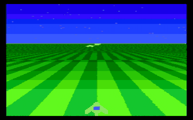

# A systolic retro console that races the beam

The video and sound half of a small games console, in the spirit of the
1970s and 80s machines that had no frame buffer, targeting NTSC composite
video. The chip draws every scanline from a 54-byte line packet that the
CPU (the RP2040 on the Tiny Tapeout demo board) sends during the previous
line; the game logic lives on the CPU, the timing lives on the chip.

The clip is the chip's own pin output, simulated cycle by cycle in
Hardcaml, turned into a composite signal with a resistor-DAC model and
decoded by the software TV from `../composite-video/`. Scene, art and
game are original: a delta-wing fighter over a scrolling perspective
checkerboard, a star field with parallax, saucers approaching from the
horizon, lasers and explosions, driven by a scripted SNES pad.

## The chip (`console.ml`)

- **Colour the way early consoles did it.** The clock is 16 times the NTSC
  colour subcarrier (57.27 MHz), so a hue is one of 16 phase shifts of a
  square wave on the chroma pins; the burst drives one chroma pin and
  coloured pixels drive two, for more saturation. Brightness is a 4-pin
  resistor DAC whose codes put sync, blank and white at the standard
  NTSC ratios. Measured through the software TV the 15 hues come out as a
  full colour wheel (`out/palette.png`).
- **A systolic packet chain.** The line packet shifts into a byte-wide
  chain, one byte per strobe, with no address decoding, and is copied to
  the active registers at the start of the line.
- **A systolic sprite pipeline.** The pixel stream flows through sixteen
  identical cells, one register stage each; a cell overwrites the pixel
  where its sprite (8-bit bitmap, each bit two pixels wide, 16 pixels)
  covers it, and later cells win. Every line gets its own sixteen sprites,
  so a whole screen can hold hundreds of objects.
- **A perspective ground without a multiplier.** The background colour is
  bit 12 of `u0 + px * step`, computed by adding `step` once per pixel;
  the CPU precomputes per-line depth tables, so a checkerboard plane,
  scrolling and fog cost two colours and two 16-bit numbers per line.
- 256 pixels per line (11 clocks each), 224 visible lines, 262-line
  progressive fields at 59.94 Hz.

## Results

| Check | Result |
| --- | --- |
| Lockstep of the pixel pipeline against a reference model, 672 random lines x 256 pixels | 0 mismatches |
| Same test with a planted bug (sprites one pixel narrower) | 4,105 mismatches, caught |
| Palette through the software TV | 15 distinct hues around the colour wheel plus grey, 11 brightness levels |
| 120 fields of the demo game | decoded cleanly (`out/frame_000.png`, `frame_060.png`, `frame_110.png`, `demo.gif`) |
| Synthesis on sg13g2, flattened | 5,255 cells, 94,319 um2, 1,198 flip-flops |

Three Tiny Tapeout tiles at full utilisation. The flip-flops are mostly
the double-buffered 54-byte packet (864 of them); moving the shadow copy
into an SRAM macro would roughly halve the area. Not yet through place and
route.

## Input

The CPU runs the game, so it reads the pad: a SNES pad is three wires
(latch, clock, data), sixteen bits per frame, and its 4021 shift registers
run at 3.3 V. Reading it on the chip instead is a handful of flip-flops
but needs a pin to hand the bits to the CPU.

## Not done

Sound (the one-bit synthesiser is the obvious block), place and route,
the real resistor network and a real TV, and the CPU-side firmware
(streaming 54 bytes per line at 15.7 kHz, about 850 KB/s, is a PIO and
DMA job on the RP2040).

Build and run (Hardcaml v0.17, Python via uv):

    opam exec --switch=5.3.0 -- dune build
    dune exec ./main.exe -- check      # lockstep test
    dune exec ./main.exe -- palette && uv run console_tv.py palette
    dune exec ./main.exe -- game 120 && uv run console_tv.py frames
