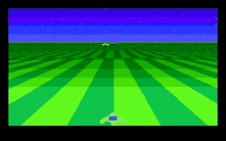
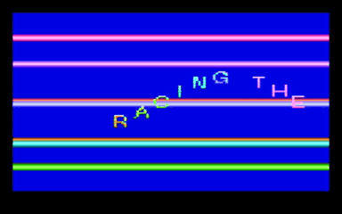

# A systolic retro console that races the beam

The video and sound half of a small games console, in the spirit of the
1970s and 80s machines that had no frame buffer, targeting PAL composite
video (an NTSC version is in the git history). The chip draws every scanline from a 54-byte line packet that the
CPU (the RP2040 on the Tiny Tapeout demo board) sends during the previous
line; the game logic lives on the CPU, the timing lives on the chip.

The clips are the chip's own pin output, simulated cycle by cycle in
Hardcaml, turned into a composite signal with a resistor-DAC model and
decoded by the software TV from `../composite-video/`. Everything shown
is original. The game (`game.ml`): a delta-wing fighter over a scrolling
perspective checkerboard, a star field with parallax, saucers approaching
from the horizon, lasers and explosions, driven by a scripted SNES pad.
The demo reel (`demo.ml`), three raster effects in the demoscene
tradition: copper bars behind a sine-wave text scroller that uses all
sixteen sprite slots, a rotozoomer (a rotating, zooming checkerboard), and
a 3D star field with a pulsing title. Glyphs come from Pillow's built-in
default font, re-centred into 8 x 11 cells (`font.ml`).

## The chip (`console.ml`)

- **Colour the way early consoles did it.** The clock is 12 times the PAL
  colour subcarrier (53.20 MHz), so a hue is one of 12 phase shifts of a
  square wave on the chroma pins, mirrored on alternate lines as PAL
  requires, with the burst swinging to match; the burst drives one chroma
  pin and coloured pixels drive two, for more saturation. Brightness is a
  4-pin resistor DAC. Measured through the software TV the 12 hues come
  out as a full colour wheel (`out/palette.png`).
- **Why PAL.** The RP2040 on the demo board can make 53.200 MHz, 64 ppm
  from exact, which a TV's colour lock should tolerate; the nearest it
  gets to NTSC's 57.27 MHz is 1,058 ppm off, which no TV locks to. PAL
  costs slightly more logic on the chip but saves an oscillator on the
  board.
- **A systolic packet chain.** The line packet shifts into a byte-wide
  chain, one byte per strobe, with no address decoding, and is copied to
  the active registers at the start of the line.
- **A systolic sprite pipeline.** The pixel stream flows through sixteen
  identical cells, one register stage each; a cell overwrites the pixel
  where its sprite (8-bit bitmap, each bit two pixels wide, 16 pixels)
  covers it, and later cells win. Every line gets its own sixteen sprites,
  so a whole screen can hold hundreds of objects.
- **Backgrounds without a multiplier.** The background colour is bit 12
  of `u` XOR bit 12 of `v`, where `u` and `v` each start at a per-line
  value and add a per-line step once per pixel. With `v` fixed that is
  stripes, which with per-line depth tables from the CPU becomes a
  perspective checkerboard ground; with both moving it is a rotated and
  zoomed checkerboard, the rotozoomer.
- 256 pixels per line (10 clocks each), 240 visible lines, 312-line
  progressive fields at 50 Hz.

## Results

| Check | Result |
| --- | --- |
| Lockstep of the pixel pipeline against a reference model, 720 random lines x 256 pixels (PAL build) | 0 mismatches |
| Same test with a planted bug (sprites one pixel narrower) | 4,105 mismatches, caught |
| Palette through the software TV | 12 hues around the colour wheel plus grey, 11 brightness levels |
| 120 fields of the game, 540 of the demo reel | decoded cleanly (`game.gif`, `reel.gif`, stills in `out/`) |
| Synthesis on sg13g2, flattened (NTSC build, before the second accumulator) | 5,255 cells, 94,319 um2, 1,198 flip-flops |

Three Tiny Tapeout tiles at full utilisation. The flip-flops are mostly
the double-buffered 54-byte packet (864 of them); moving the shadow copy
into an SRAM macro would roughly halve the area. Not yet through place and
route.

The first reel render showed O as C and M as N: the glyphs had been drawn
one pixel in from the cell edge, so wide letters lost a column. The font
generator now centres each glyph.

## Input

The CPU runs the game, so it reads the pad: a SNES pad is three wires
(latch, clock, data), sixteen bits per frame, and its 4021 shift registers
run at 3.3 V. Reading it on the chip instead is a handful of flip-flops
but needs a pin to hand the bits to the CPU.

## Not done

Sound (the one-bit synthesiser is the obvious block), place and route,
the real resistor network and a real TV, and the CPU-side firmware
(streaming 54 bytes per line at 15.7 kHz, about 850 KB/s, is a PIO and
DMA job on the RP2040).

Build and run (Hardcaml v0.17, Python via uv):

    opam exec --switch=5.3.0 -- dune build
    dune exec ./main.exe -- check      # lockstep test
    dune exec ./main.exe -- palette && uv run console_tv.py palette
    dune exec ./main.exe -- game 120 && uv run console_tv.py frames frame
    dune exec ./main.exe -- demo 540 && uv run console_tv.py frames demo
