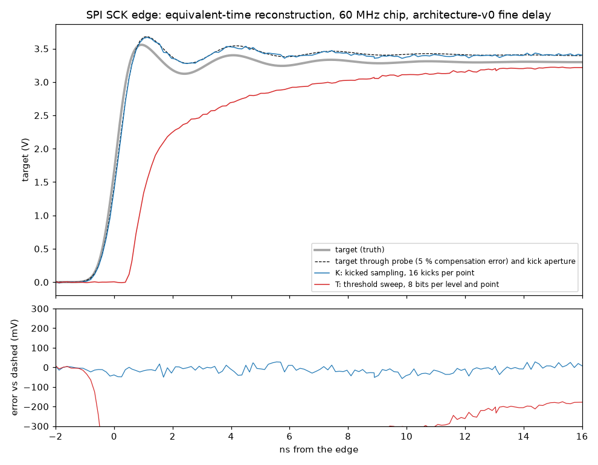
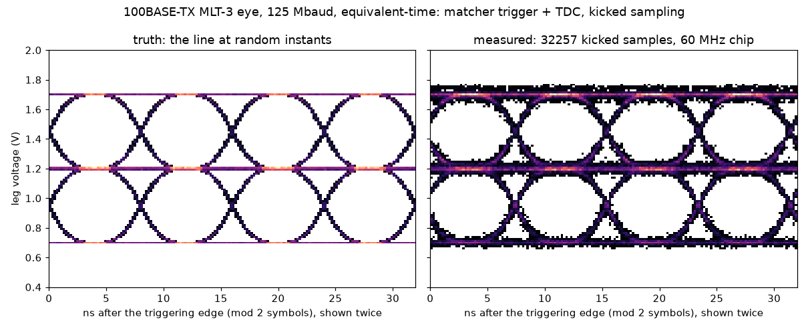

# The chip as an oscilloscope far beyond its clock

How the Tiny Tapeout chip (IHP SG13G2, 60 MHz core clock, digital pins only) can work as a
debugging oscilloscope, and how far past the naive limit it gets. The naive limit is one bit per
pin per clock (60 MS/s, 30 MHz), or 240 MS/s with the four-phase stage.

Everything here is simulation. The pad is SPICE-characterised: the sg13g2 I/O netlist in ngspice
with PSP 103. A comparator model fitted to that SPICE run drives every study. The time base is
architecture v0's fine-delay option. Numbers marked ASSUMPTION in the code are not measured.
Every number below comes from a file in `results/` or `plots/`.

**How far to trust it.** An adversarial review (codex, `gpt-6-luna`; findings in "Review" at the
end) called these plausible exploratory simulations, not established chip capabilities. That is
right, and it applies to every row of the table below. In particular:

- the demonstrations use the same pad model to make the readings and to invert them, so their
  errors measure noise and calibration under a matched model, not model error;
- the 0.79 GHz aperture comes from the fitted model; SPICE checked it only for a 200 ps kick.

## Summary

| | naive | this design | limited by |
|---|---|---|---|
| repetitive waveform, bandwidth | 30 MHz (120 MHz four-phase) | **0.8 GHz** (kicked sampling, -3 dB) | the pad's decision aperture (165 ps rms), not jitter |
| time resolution | 16.7 ns (4.2 ns) | 130 ps bins; instants known to **11 ps** INL; about 20 ps rms jitter | code-density statistics; supply noise on the line |
| voltage, per shot / averaged | 1 bit | 55 mV at the target per kick (k_s = 0.1); **7-9 mV** rms after 16 kicks | the pad's threshold versus core supply (0.43 V/V), launch jitter |
| SCK edge (1 ns, 300 MHz ringing) | invisible | 22 mV rms error; rise 943 ps (951 expected), ringing 302 MHz, 322 of 332 mV; **0.94 ms** of chip time | aperture, probe compensation |
| 125 Mbaud MLT-3 eye | impossible | full eye, 7.2 ns width at the mid level as the truth, 425 mV height (truth 497); **5.8 ms** | per-sample noise, host link |
| I2C rise | coarse | 9.7 mV rms; tau 937 ns (940); 199 pF inferred; 30-70 % rise 783 ns (796) | fine for slow edges; the threshold sweep cannot see the 10 ns fall |
| non-repetitive sparse spectrum | 30 MHz | **K ≤ 4 tones anywhere in 5-700 MHz** from 100 random kicks (30 MS/s); K = 8 from 800 | sparsity; aperture known in the atoms |
| which of K (frames, baud rates, protocols, spec) | decode: 64-4,000 samples | **2-16 samples** at 0 errors in hundreds of trials | the question's entropy, not the bandwidth |
| receive NRZ | 60 Mbit/s (4x oversampling) | **240 Mbit/s** one locked sample per bit; repeated frames read at 400 Mbit/s | 4 lanes per clock; the pad's full-swing limit, about 400 Mbit/s |

## 1. The pad, as SPICE sees it (`spice/`, `padmodel.py`)

`sg13g2_IOPadIn` is two ESD diode pairs, a 590 ohm secondary-protection resistor, then a
thick-oxide inverter and a thin-oxide inverter, both on the 1.2 V core supply
(`spice/pad.py`, flattened from the PDK netlist).

- **Threshold** 0.589 V (tt), 0.614 V (ss 125 °C), 0.568 V (ff -40 °C). It moves with the core
  supply at **0.43 V/V** (`results/pad-dc.txt`). Core-supply noise is therefore threshold noise:
  2.1 mV for an assumed 5 mV rms.
- **Input capacitance** 0.1 pF at the threshold. **Input-referred noise** 0.36 mV to 300 MHz and
  0.68 mV to 1 GHz. Gain at DC is 720 (`results/pad-noise.txt`).
- **It decides slowly at small overdrive.** A step from 200 mV below the threshold to 100 mV above
  it takes 2.5 ns to reach the core; to 300 mV above, 0.43 ns (`results/pad-walk.txt`). A sine
  20 mV above the threshold needs **150 mV of amplitude at 100 MHz** to toggle the pad, 395 mV at
  500 MHz, and none below 500 mV at 1 GHz (`results/pad-sine.txt`). IHP's "clean to 200 MHz" is
  for full-swing inputs; for a threshold comparator the pad is a slow integrator.
- **A kick makes it fast and linear.** Kick the pin up by 0.5 V in 200 ps from 250 mV below the
  threshold, and the delay to the pad's output falls with the pin's level before the kick: 1,081 ps
  at -60 mV, 731 ps at 0, 549 ps at +60 mV, about **4 ps per mV** (`results/pad2-kick.txt`). A 30 mV,
  100 ps bump moves that delay only when it sits 100 to 700 ps after the kick starts
  (`results/pad2-aper.txt`). This window is the sampling aperture.
- **Fitted model** (`padmodel.py`). The thick inverter's I-V surface is tabulated by SPICE (ss, tt
  and ff), and a three-parameter ODE is fitted to ten SPICE step responses. On 25 waveforms not used
  in the fit it reproduces the kick and aperture delays to a constant -36 ps offset, varying by
  2 ps (`results/padmodel-validate.txt`). It misses one re-crossing edge on the ringing SCK
  waveforms (+270 ps). With the threshold at 2.8 V or 3.3 V on the SCK waveform, SPICE and the
  model both give **no edge at all**, although the ringing overshoots the threshold by up to 190 mV
  at the pin for about a nanosecond.
- **The OCaml port** (`ocaml/chain.ml`) matches the Python model exactly on five kick waveforms
  (`results/ocaml-padcheck.txt`).

## 2. Two ways to read a voltage with a digital input

- **T, threshold sweep.** A DAC shifts the pin so that the threshold sits at a chosen target
  level; the sampler records one bit at a DTC-placed instant. The level where the fraction of 1s
  crosses one half is the waveform's value there. It works for slow signals. On fast ones the
  slow small-overdrive decision smears it: the SCK edge reads as a 6.2 ns rise, 880 ps late, with
  the ringing gone (`results/sck.txt`).
- **K, kicked sampling** (new). An output pin kicks the input pin through a small capacitor at
  the chosen instant. The TDC times the pad's output edge; a calibration table (DAC trim steps on a
  static pin) turns delay into voltage. It gives several bits per shot.
  - **Aperture:** with the liberty's 500 ps kick (the 16 mA pad into 1 pF), the centroid is 610 ps
    after the kick starts, 165 ps rms wide, **0.79 GHz** at -3 dB. With a 200 ps kick it is
    0.88 GHz. The integral is 1.03: linear for small static offsets. Source: `results/kick.txt`,
    `pad_kick.py`.
  - **What SPICE checked:** the 200 ps case, where the model's delays follow SPICE's across bump
    positions to within 2 ps, after a constant 36 ps offset (`results/padmodel-validate.txt`, aper
    rows). The 500 ps figure is the model's alone.
  - **Usable range:** a 210 mV window at the pin (the steep part, above 2.5 ps/mV). Signals larger
    than that at the pin are covered by a few DAC "tiles".
  - **Per-kick scatter:** 5.5 mV rms at the pin. Threshold noise, launch jitter (ASSUMPTION
    10 ps), Vernier quantisation and kick amplitude all contribute.

## 3. Time base (architecture v0 fine delay, `scopemodel.TimeBase`, `ocaml/chain.ml`)

The fine delay is four clock phases plus a quarter-period line of `sg13g2_dlygate4sd1` (134 ps typ).
That gives 128 bins per 16.67 ns clock, with 3 % per-stage mismatch, a 20 ps systematic bow and
50 ps rms phase skews (ASSUMPTIONS).

- **Calibration:** code density with 2 million asynchronous hits (33 ms at 60 MHz) leaves
  **11 ps** INL.
- **TDC:** thermometer bins plus a Vernier interpolator (15 ps step, 2 ps residual INL; new, about
  700 µm² per TDC, est).
- **Jitter** (ASSUMPTIONS):
  - clock: 10 ps per period, accumulated over the clocks since the trigger;
  - supply: 0.54 % of the delay-line part (at most 4.2 ns, so at most 23 ps);
  - output pads: 10 ps launch jitter.

A 25 ps Gaussian jitter would cut at 5 GHz, so jitter is not the bandwidth limit; the pad
aperture is.

## 4. Demonstrations

**(a) SPI SCK edge** (`demo_sck.py`, `results/sck.txt`, `plots/sck.png`). 1 ns rise, 400 mV of
300 MHz ringing decaying with 3 ns. The chip launches SCK itself, so the trigger is its own clock.
The probe has k_s = 0.1 and a 5 % compensation error.

- Kicked sampling, 4 DAC tiles × 139 instants × 16 kicks, **0.94 ms** of chip time including
  calibration.
- Error: 22 mV rms against the probed target seen through the aperture, and 20 mV once the time
  axis is aligned (-10 ps).
- Rise 943 ps (951 expected through probe and aperture, 894 at the sampled instants); ringing
  302 MHz, 322 mV, tau 3.3 ns (expected 306 MHz, 332 mV, 3.4 ns). Noise on the flat part 7.3 mV.
- Against the raw target the error is 125 mV. That error is the probe's 5 % compensation
  overshoot, which a user trims out with the chip's own square wave, as with a scope probe.
- The threshold sweep, 196k one-bit samples, fails as described in section 2.

**(b) 100BASE-TX MLT-3 eye** (`demo_eye.py`, `results/eye.txt`, `plots/eye.png`). 125 Mbaud,
+-0.5 V on one leg, 3.5 ns edges, 30 ps RJ, 50 ppm off the chip's clock.

- **Trigger:** the systolic matcher fires on the pattern -1, 0, +1 and the TDC timestamps that
  +1 crossing. Threshold noise adds 15.5 ps there. The model idealises the matcher: it finds the
  pattern from the true symbols, never missing or false-firing. The crossing itself is the true
  waveform's, plus pad noise and the TDC.
- **Symbol period:** fitted from 12,649 trigger timestamps; exact to 0.00 ppm.
- **Kicks:** from a plain four-phase lane on a random quarter, 8 per trigger after a 4-clock
  matcher latency, 4 DAC tiles, k_s = 0.4. The samples are folded over two symbols.
- **Result:** 101k kicks in **5.8 ms**. Per-sample error 14.9 mV rms. Eye width 7.2 ns at the mid
  level, as the truth. Height 425 mV against 497 mV; the difference is the per-sample noise.
- **Data rate:** raw kicks would need 70 MB/s against the host link's 7.5 MB/s. A PE histogram
  in a gain-cell bank (8 kB) avoids that.

**(c) I2C open-drain rise** (`demo_i2c.py`, `results/i2c.txt`, `plots/i2c.png`). 4.7 kohm,
200 pF, V_OL 0.15 V. Threshold sweep over 256 ladder levels × 8 × 869 instants.

- **Walk correction:** the pad decides 44 ns late at 0.1 mV/ns and 2 ns late at 100 mV/ns. The
  host corrects each instant from the reconstruction's own slope.
- **Accuracy:** 9.7 mV rms on the rise and 7.0 mV on the plateau.
- **Answers:**
  - V_OL: 144 mV;
  - tau: 937 ± 2 ns (true 940), so **199 pF** for the known pull-up;
  - 30-70 % rise: 783 ns (796): fails fast mode, passes standard mode.
- **The fall:** the 10 ns fall comes out as 23-30 ns, because the threshold sweep's decision delay
  varies along a fast edge. Measure it with kicked sampling.
- **Chip time:** 7 ms with the sampler's timed mode for the rise; 1.2 s for the fine window.

## 5. Beyond Nyquist without repetition: compressed sensing (`ocaml/cs.ml`, `results/cs.txt`)

**A. Random-time kicked sampling.** One kick every second clock at a random clock parity and bin
(TRNG/LFSR), so the average rate is 30 MS/s. The host knows each instant from the calibrated time
base and puts the known aperture response into the atoms. Recovery is OMP with off-grid
golden-section refinement.

| K \ M kicks | 100 | 200 | 400 | 800 |
|---|---|---|---|---|
| 1 | 20/20 | 20/20 | 20/20 | 20/20 |
| 2 | 20/20 | 20/20 | 20/20 | 20/20 |
| 4 | 20/20 | 20/20 | 20/20 | 20/20 |
| 8 | 5/20 | 15/20 | 17/20 | 19/20 |
| 16 | 0/20 | 0/20 | 9/20 | 13/20 |

- **What counts as success:** tones in 5-700 MHz (Nyquist would need 1.4 GS/s); every tone found
  within 1/W and within 25 % in amplitude.
- **Where it fails:** when K is too large for M (roughly M below 25K here), when tones are closer
  than about 3/W, for non-sparse signals (edges and eyes, which are wideband), and above the
  aperture (0.76 at 700 MHz).
- **Host work:** 119 M correlation MACs and 1.9 M other flops for K = 4, M = 400. That is 0.09 s
  here, or 2.4 s on an RP2350 at an assumed 50 M MAC/s. **Correlation is 98 % of the work.** The
  array has no multiplier; with 1-bit data and sign atoms the correlation becomes add/subtract,
  but the random instants would need a phase multiply. So the array does not fit this recovery
  well, and a PC host is the natural solver.

**B. Random demodulator** (Tropp et al. 2010) on 1-bit samples. The chain:

- the four-phase sampler at 240 MS/s;
- a random dither: uniform, a new level every quarter clock (ASSUMPTION: a 4-pin random DAC);
- XOR with an LFSR (the GF(2) PE mode);
- sums over L chips in a PE accumulator;
- recovery on the host with four interleaved FFTs, 84 M flops, 0.65 s here.

This band is below 120 MHz, so here CS does not beat Nyquist; **it compresses the data rate**.

| comparator, dither, L | K=1 | 2 | 4 | 8 |
|---|---|---|---|---|
| ideal, ±100 mV, L = 1 (240 Mbit/s raw) | 6/6 | 6/6 | 6/6 | 6/6 |
| ideal, ±100 mV, L = 8 (30 MS/s of sums) | 6/6 | 6/6 | 6/6 | 1/6 |
| ideal, ±100 mV, L = 32 (7.5 MS/s) | 6/6 | 6/6 | 1/6 | 0/6 |
| ideal, ±100 mV, L = 128 (1.9 MB/s, fits the host link) | 6/6 | 4/6 | 0/6 | 0/6 |
| SPICE-fitted pad, ±300 mV, L = 8 | 3/3 | 1/3 | 0/3 | 0/3 |
| SPICE-fitted pad, ±100 mV, L = 8 | 1/3 | 0/3 | 0/3 | 0/3 |

Noise folding costs 1/sqrt(L), and the dither's quantisation noise is about 1 per chip, so it
needs windows of hundreds of µs. With the real pad the frequencies are found but the amplitudes
are not: in the example, 701 mV came out for a 277 mV tone. The dithered bits are distorted by
the pad's slow small-overdrive decision. The random demodulator is therefore a data-rate tool,
and only with a characterised pad transfer or a faster comparator. Random-time kicked sampling is
the one that goes beyond Nyquist.

## 6. Finite rate of innovation: edges finer than the sample period (`ocaml/fri.ml`, `results/fri.txt`)

A digital line has two unknowns per edge. An RC kernel in front of the kicked input and the
exponential-reproducing FRI solution (two samples per edge, 33 ns apart) locate an edge to:

- 1.9 ns rms at tau 20 ns, with 5.5 mV per-sample noise;
- 480 ps when 16 kicks are averaged;
- 67 ps at the pad's thermal noise alone.

That is far below the sample period, but the TDC does the same job at about 20 ps with one
timestamp. A comparator plus a timestamp *is* an FRI sampler with an ideal kernel. FRI helps where
no comparator sees the event: pulses below the pad's decision overdrive, or amplitude and time
wanted jointly from a slow, averaged channel.

## 7. Receiving below the sample budget (`ocaml/rx.ml`, `results/rx.txt`)

The line is NRZ with +100 ppm, 0.2 UI of wander at 100 kHz and random jitter.

- **Locked 1x against 4x.** The 4x receiver is the four-phase sampler with a tracker; its centre
  is quantised to 4.17 ns, and it can only reach 60 Mbit/s. The 1x receiver takes the TDC
  timestamp of every edge, runs a PI loop, and places one sample per bit per lane through the
  DTC. That takes it to 240 Mbit/s at 4 bits per clock, storing a quarter of the samples. Error
  rates against jitter are in `results/rx.txt`.
- **What the 1x model knows that a chip would not:** the TDC sees every true edge, which is
  realistic. When the receiver's own bit count since the last edge disagrees with the true index,
  the model counts a slip, charges it 8 bit errors and re-synchronises it from the truth; the slip
  total is printed. A real receiver would need a framing check to recover from a slip.
- **Skip predictable fields.** For a known frame format, read only the open bits:
  - Ethernet/IPv4/UDP with a 16-byte payload from a known peer: 208 of 560 bits (37 %), keeping
    the FCS as the integrity check;
  - CAN from a known ID: 79 of 108;
  - an SPI status poll: 8 of 16.

  Simulated: 200 such Ethernet frames at 125 Mbit/s, reading only the open bits, 41,600 reads,
  0 errors. Tracking still uses every edge; the saving is in samples stored, decided and shipped.
- **Faster than the clock.** A repeating 256-bit frame at 250 or 400 Mbit/s is read completely
  in 2 repetitions with 0 errors; each lane reads a different subset. Above that the pad limits
  (full-swing inputs, about 400 Mbit/s).

## 8. Asking the question instead of reconstructing (`ocaml/infer.ml`, `results/infer.txt`)

Each question is a small multiple choice. The chip takes one 1-bit sample per trigger at an
instant and threshold chosen to maximise the expected information about the remaining candidates,
keeps a posterior over them, and stops at 1 - 1e-3 (Davenport et al. 2010 do this for compressive
measurements). The tables come from generative models with unknown data, jitter and noise. The
observations are drawn from fresh simulations of the true candidate, not from the table.

| question | K | greedy (mean samples) | random instants | decode instead |
|---|---|---|---|---|
| which frame, 125 Mbit/s, strong | 2 / 4 / 8 | see `results/infer.txt` | | 64 samples |
| which frame, weak (per-sample errors 10 %) | 2 / 4 / 8 | | | ~320 |
| which UART baud rate (data unknown) | 2 / 4 / 8 | | | 3,840 |
| which protocol (UART, I2C, SPI, CAN, WS2812, PWM, ...) | 2 / 4 / 8 | | | ~4,000 |
| is the I2C rise within 300 ns (250 against 350 ns) | 2 | | | 1.8 M (demo c) |

- **Caveats:**
  - the tables come from finite Monte Carlo (150-4,000 draws per entry, clamped to
    [0.001, 0.999]), and the posterior treats them as exact;
  - "0 errors in N trials" bounds the error rate only to about 3/N, not to the 1e-3 target;
  - only "which frame" has a simulated baseline (in-order reading with the same stopping rule);
    the other decode figures are capture-size estimates.
- **CRC consistency has no such shortcut.** Every covered bit can flip the answer, so it is a
  decode question, and the CRC unit on the bit path answers it at line rate.
- **Hardware mapping:**
  - the posterior is K log-likelihood accumulators, one PE each, adding a table-lookup LLR per
    sample from a bank;
  - the policy is either the host choosing each next sample (tens of µs on an RP2350, fine for
    repeated events) or a decision tree precomputed by the host and walked by a sequencer thread
    (WAITC branches);
  - the systolic matcher supplies the trigger.

## 9. The real limits

| limit | value | source |
|---|---|---|
| kicked-sampling aperture | 0.79 GHz (-3 dB), 165 ps rms | `results/kick.txt` (SPICE-fitted model; SPICE window 100-700 ps) |
| threshold comparator at small overdrive | 150 mV needed at 100 MHz; 2.5 ns decision at 100 mV | `results/pad-sine.txt`, `pad-walk.txt` |
| jitter floor | about 20-30 ps rms (clock 10 ps/period, line 0.54 % of its delay, pads 10 ps: ASSUMPTIONS) | `scopemodel.py`; not binding below 5 GHz |
| calibration | 11 ps INL after 2e6 code-density hits | `results/sck.txt` |
| voltage | threshold 0.43 V/V of core supply; 0.7 mV thermal; 5.5 mV per kick at the pin | `results/pad-dc.txt`, `pad-noise.txt`, `sck.txt` |
| DAC | an 8-bit ladder with 1 % resistors has several LSB of INL: calibrate it against a sigma-delta trim pin (assumed to 0.3 LSB) | `scopemodel.Dac` |
| probe | 5 % compensation error is the largest error on a 3.3 V edge (125 mV) | `results/sck.txt` |
| data to the host | 7.5 MB/s link against 70 MB/s of raw kicks | `results/eye.txt` |

## 10. Hardware and area

| need | block | area |
|---|---|---|
| instants and timestamps | the fine-delay option on two pins (architecture v0 2.2): DTC per lane, TDC | 2 × 6,500 µm² (est, already in the budget) |
| sub-bin timing for kicked sampling | Vernier interpolator per TDC, 10-16 stages | about 700 µm² each (est, new) |
| kick | one output pin; a 0.5 pF capacitor to the input pin on the board | pin |
| trigger | the systolic matcher (exists), plus the TDC | 11,422 µm² (exists) |
| random instants | TRNG or a PE LFSR (architecture v0 section 7) | about 1k µm² (est) |
| histograms, sums, LLRs | PE accumulators and a gain-cell bank | existing |
| DAC | the 8-pin ladder costs too many pins on Tiny Tapeout. One sigma-delta pin from the pin NCO with a 2-pole RC gives the few static levels kicked sampling needs (2-4 tiles, ms settling) | 1 pin + RC |
| dither for the random demodulator | 4 output pins as a random DAC | 4 pins; not recommended |

Board parts: the probe network (Rs, Rd with a trimmer capacitor, as in a 10x probe), the kick
capacitor, and the DAC's RC.

**Using it.** The RP2350 host programmes a sequencer thread with the shot schedule: trigger, kick
clock and bin, DAC tile. It drains TDC words or PE histograms over the 4-bit host link. It
applies the calibration tables (code density, the V-to-T table, DAC levels) and ships waveforms or
answers to a PC over USB, where a small tool plots them (the plots here come from the Python demos).

## Review

`codex-luna` (gpt-6-luna) was asked to refute this study. Its findings, and what was done:

1. **The 0.79 GHz aperture is a model result.** Agreed. SPICE checked only the 200 ps kick; this
   is now stated in section 2.
2. **Device and host share the pad tables.** Agreed, and stated at the top. Model error would
   show up only against SPICE or silicon.
3. **The eye trigger uses the true symbols.** Agreed. Matcher misses and false fires are not
   modelled (section 4b). The dead expression it found is removed; the per-sample truth
   deliberately uses the physical kick instant.
4. **The receiver knows the true bit index.** Partly: the TDC seeing true edges is realistic. The
   re-synchronisation to the true index is now counted and reported as slips (section 7).
5. **Finite tables make the inference overconfident.** Agreed, stated in section 8; the full runs
   use more draws and trials than the quick ones it read.
6. **Decode baselines.** Agreed, stated in section 8.
7. **The random demodulator's front end is idealised.** Agreed; the dither is an ASSUMPTION
   (section 5).
8. **The full result files were missing.** At review time they were; they are now committed
   (`results/rx.txt`, `results/infer.txt`).

## Files

| file | what |
|---|---|
| `spice/pad.py`, `pad2.py`, `run.sh`, `run2.sh` | ngspice characterisation of `sg13g2_IOPadIn` (container `spice-retention`) |
| `padmodel.py` | fitted comparator ODE, fit and validation |
| `pad_kick.py` | kicked sampling: V-to-T curve and aperture |
| `scopemodel.py`, `acq.py` | probe, DAC, time base and TDC, the T and K engines |
| `demo_sck.py`, `demo_eye.py`, `demo_i2c.py` | demonstrations (a) to (c) |
| `export_tables.py`, `ocaml/data/` | SPICE-derived tables for OCaml |
| `ocaml/chain.ml` | OCaml port of the chain (pad ODE, time base, TDC, kick) |
| `ocaml/cs.ml`, `linalg.ml` | compressed sensing, OMP |
| `ocaml/fri.ml`, `rx.ml`, `infer.ml` | FRI edges, locked receive, question-driven inference |

Run the Python files with `uv run --with numpy --with scipy --with matplotlib python <file>`.
Build the OCaml with `opam exec --switch=5.3.0 -- dune build` in `ocaml/`, then run
`./_build/default/<name>.exe` from there.

**To port to OCaml:** the three demonstrations and the pad fit are still Python. The chain they
use is already ported and checked.

## Open questions

- **Silicon:** the kick aperture and the 4 ps/mV slope need measuring on a real pad and board;
  the board's pin capacitance sets the kick amplitude.
- **Supply-noise jitter** of the delay line and the output pads is assumed, not simulated.
- **Pad model accuracy:** the fitted model misses re-crossings at small overdrive (+270 ps on one
  SPICE edge). The threshold sweep's failure on fast signals is shown by SPICE directly, so this
  does not change the conclusions.
- **Tiny Tapeout I/O:** whether the pads can take a board capacitor and a probe network on an
  input, and whether the mux in front of our tile adds bandwidth limits beyond the pad.
