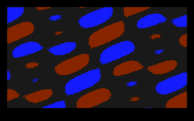

# Wave engine and "Interference"

A video chip whose picture is a sum of up to ten plane waves, racing the
beam in PAL, and an original game in the Fourier idea space made for it.
The idea of a game played through wave interference comes from Frequon
Invaders (2002); the design, rules and look here are our own.

The clip is the chip's own pin output, simulated in Hardcaml and decoded by
the software TV from `../composite-video/`.

## The game (`game.ml`)

What you see is the sum of the waves; there are no sprites. Invaders are
frequencies whose waves grow stronger over time; one left at full strength
too long costs a life (the screen flashes red). The player owns one wave
and cancels an invader by matching its frequency and phase with the
opposite sign: destructive interference, visible as the invader's pattern
fading while the player's wave closes in, then a bright flash. The pad
steers the player's wave through frequency space (direction pad) and phase
(shoulder buttons); in the demo an autopilot plays, locking on to the
strongest invader. 300 fields: 7 invaders cancelled, 3 lives left. Waves are
kept coarse, wavelengths of about 40 to 120 pixels, because composite
video carries colour at only about 1.3 MHz.

## The chip (`wave.ml`)

- **Per-line packet, 66 bytes:** a 16-colour palette, then for each of ten
  waves its start phase for this line (the CPU computes `phi + ky * line`),
  its phase step per pixel (`kx`) and an amplitude byte (on, negate, right
  shift 0 to 3).
- **One adder and one sine table for every wave.** The ten wave records sit
  on a ring that rotates once per clock, so each record passes the head once
  per ten-clock pixel. The head looks up the sine of its phase, applies its
  amplitude, adds it to the pixel's sum, and advances its own phase: a
  systolic ring doing the work of ten oscillators.
- **Colour from the sum:** palette entry `clamp(((sum + 8) >> 4) + 8, 0, 15)`,
  with a diverging palette (cool troughs, dark zero crossings, warm crests)
  chosen per line by the CPU.

## Checks and numbers

| Check | Result |
| --- | --- |
| Lockstep against the reference, 480 random lines x 256 pixels | 0 mismatches |
| Planted bug: phase drifting one extra unit per pixel | 1,466 mismatches, caught |
| Synthesis on sg13g2, flattened | 6,388 cells, 112,258 um2, 1,451 flip-flops |

About 3.5 tiles; most of the flip-flops are the double-buffered 66-byte
line packet.

The first render showed only blue and black: small wave sums shifted right
by six round toward minus infinity, so every weak crest became zero (dark)
and every weak trough minus one (blue). The sum is now rounded and scaled
by 16, and weak waves show both halves.

Build and run (Hardcaml v0.17, Python via uv):

    opam exec --switch=5.3.0 -- dune build
    ./_build/default/main.exe check
    ./_build/default/main.exe game 300 && uv run ../retro-console/console_tv.py frames game
